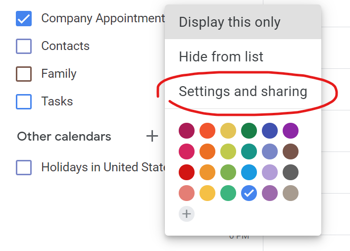
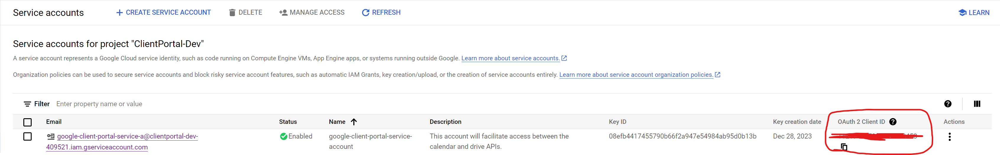

# Getting started

Welcome to your new client portal experience! This documentation will help you get started integrating with your existing services, like Google and Zoom. For the client portal to work correctly, you'll need a Google Workspace tenant - any subscription will work. 

## Integrating with Google

First, go to https://console.cloud.google.com/ and click the drop down on the top left of the screen, next to the Google Cloud logo. You should see a modal that pops up asking your to
select a resource. 

Click "New Project" in the top right corner

Create a project name (ideally something like <my-org-name>-client-portal)

Once created (it may take a few moments), click the navigation menu in the top left and select "APIs and Services". This will take you to the APIs and Services section of your integration.

<small>The client portal relies on service accounts to get and set data within your organization. You can revoke this service account at any time by coming into the APIs and Services section and removing the service account</small>

Now click "Credentials" on the left side of the screen. Then click "+ Create Credentials", then click "Service Account".

Fill out the form - be sure to give a descriptive name to the service account.

Note that on step two, you must give the role of "Service Account Token Creator" to allow for user impersonation when creating calendar events.

After you create the account, it should bring you to the IAM & Admin page

Once there, select the service account you just created, and click the "keys" tab. Then click the "Add Key" dropdown.

Select "JSON"

This should download the JSON key to your browser. Do not give this key to ANYONE, aside from the client-portal tenant settings. The key is encrypted and inaccessible to anyone other than you.

With the service account created and the key downloaded, we can start to enable the APIs. 

First, go back to the APIs and Services page

Then click "+ Enable APIs and Services"

Search for "Google Drive API", then click the box that contains the Google Drive API.

Once clicked, click "Enable"

Now go back and do the same thing for Google Calendar API

#### To enable google calendar integration

You must have a shared calendar with all of the appointments you'd like to display the busy and free times for the user. If you do not have one, this will show you how to create it.

# Create a shared calendar

Open your google calendar, and click the "+" in "Other Calendars", then click "Create new calendar"

Give it a descriptive name and description, then click "Create Calendar", then go back to your calendar list.

You should now see your calendar in the list of "My calendars".

Next, hover over the newly create calendar and click the three dots, then click "Settings and sharing"

Find "Share with specific people", and click + Add people and groups. Add the service account to the share list, and give the permission of "Make changes to events".

(Note: You may need to adjust the default maximum sharing level of your google workspace tenant to allow this permission.

https://support.google.com/calendar/thread/605495/can-not-let-other-people-make-changes-to-events?hl=en#:~:text=You%20need%20to%20need%20to,%3E%20General%20Settings%2C%20and%20save.)

Next, scroll down until you find the "Integrate Calendar" section, and find the calendar ID. Copy the calendar ID and paste it into the "Google Calendar ID" section in your tenant settings.

Now, we need to enable domain wide delegation.

Head to this <a href="https://admin.google.com/u/2/ac/owl/domainwidedelegation">link</a> (https://admin.google.com/u/2/ac/owl/domainwidedelegation), you should then see the domain-wide delegation page.

Click "Add New"

In "Client ID", copy the "OAuth2 ID" for your service account, and add the following scopes one at a time:

https://www.googleapis.com/auth/calendar
https://www.googleapis.com/auth/calendar.events
https://www.googleapis.com/auth/admin.directory.resource.calendar

To get the OAuth2 Client ID, go to your google cloud > IAM & Admin > Service Accounts, and find your service account.

--

Once everything is filled out, click "Authorize"

# Create a parent folder to store your client's data

Go to your tenant Google Drive and click "My Drive" and create a new folder.

Right click on the recently created folder and click "Share". In the sharing pane, select the service account you created in the earlier steps. Make sure the service account is an editor.

# Create a trash folder to store deleted documents

The trash folder is a area that only you can access as the tenant owner. The client cannot see or manipulate any documents inside the trash folder.

To create a trash folder, simply create a folder inside the shared parent folder, and call it trash. 

And that's it! Since the trash folder is inside the shared parent folder, it doesn't need any other permissions.

# Zoom Integration

To get enable zoom integration, you'll have to create a <a href="https://developers.zoom.us/docs/internal-apps/">server-to-server app</a>. These apps will allow the client portal to integrate with your zoom client without using OAuth to authenticate every account each time you want to do something like schedule a meeting. You'll have to perform these steps as a developer account or as an account owner.

To create a server-to-server app, head to <a href="https://marketplace.zoom.us/">https://marketplace.zoom.us/</a>.

Hover over "Develop" in the top right corner and click "Build Server-To-Server App"

And give it an appropriate name

Once created, you should be brought to your app screen. 

Copy and paste each of the App Credentials to your Client Portal Zoom integrations settings. 

Click "Information", and fill out the information provided.

Click "Scopes", and select the two scopes shown below:

(meeting:read:admin and meeting:write:admin)

These scopes allow your app to create and read meetings in Zoom, and use that information in the client portal.

Then, click "Activation", and activate your app.

Once activated, you should now be able to start using Zoom with your client portal.

# Putting it all together

Now that all of the integrations are in place, we need to put them in the settings of the client portal.

To do so, head to the client portal and sign in. Then, click the cog wheel on the left quick-access pane.

### Applying Google integrations:

In the tenant settings menu, scroll down to your "Google Integrations"

#### Parent Folder ID

Your parent folder ID is the google drive folder where you'll be storing all of your client's data. If you don't already have a parent folder set up, follow the instructions <a href="#create-a-parent-folder-to-store-your-clients-data">here</a>. To get the parent folder ID, head to Google Drive and double click the parent folder to go into it. Once you're inside the folder, the URL should say .../folders/(long string of text). Copy the text after "folders/" and place this text inside the Parent Folder ID field.

#### Group Calendar ID

The group calendar is the calendar that contains all of your appointments. To get this ID, head to your Google Calendar, select the three dots next to your group calendar, and click "settings and sharing"

Then, scroll down until you find "Calendar ID". Copy the whole text, and put that text inside the Group Calendar ID field.

#### Group Calendar User

The group calendar user is the Google Workspace user that is creating the calendar invites. This can be any user in your tenant, so long as they can access your calendar, and are apart of your Google Workspace domain.

You will simply put the email of a user in this field (e.g., jsnow@clientportal.com)

#### Google Drive Trash Folder

The trash folder contains all of your clients trashed data. To find the ID of this folder, head to Google Drive > go to your parent folder > find your trash folder and double click it > then grab the ID from the URL

Put this ID in the trash folder field.

#### Group Service Account Key

The service account key tells the client portal how to authorize requests against your Google Workspace tenant. To upload a key, simply click "Upload Key" and find the .JSON key that you downloaded when creating your <a href="#integrating-with-google">Google Cloud Service Account</a>. 

### Applying Zoom integrations:

